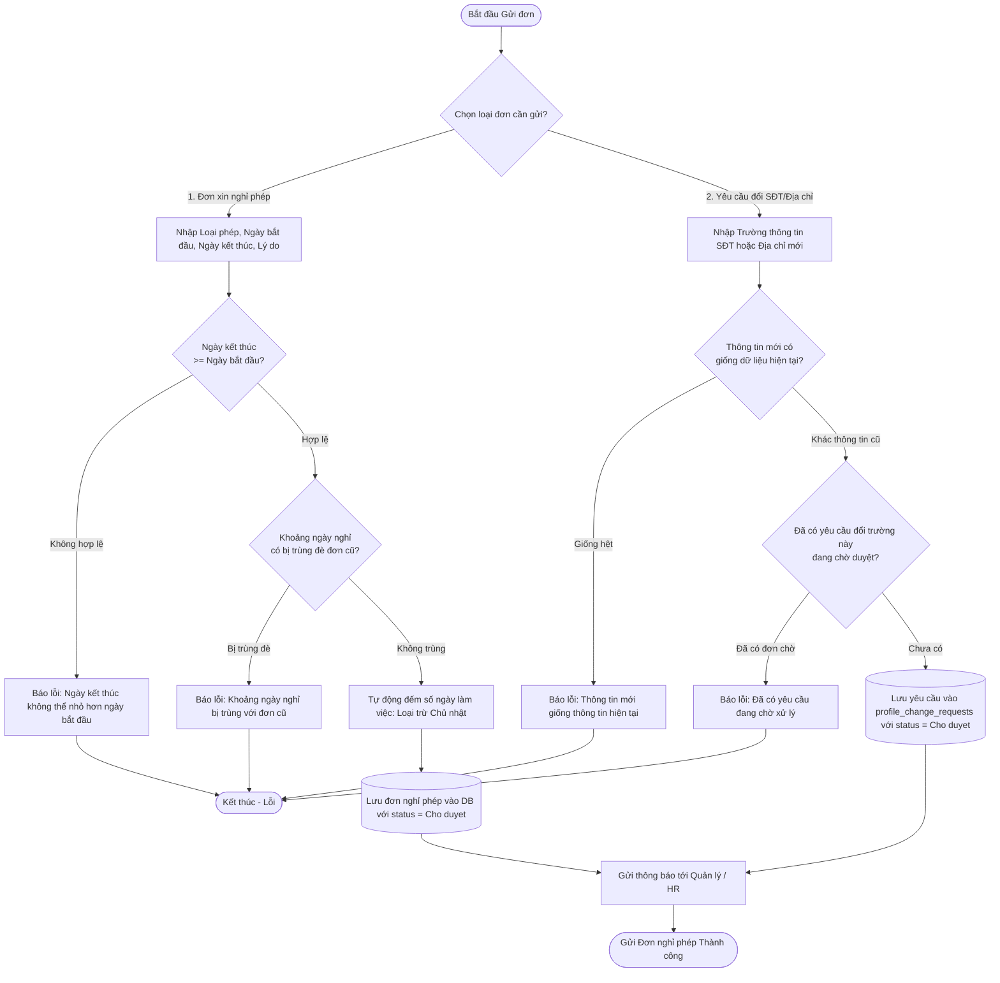
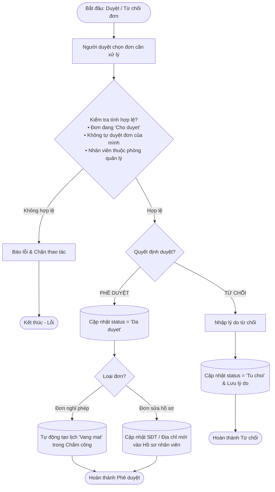
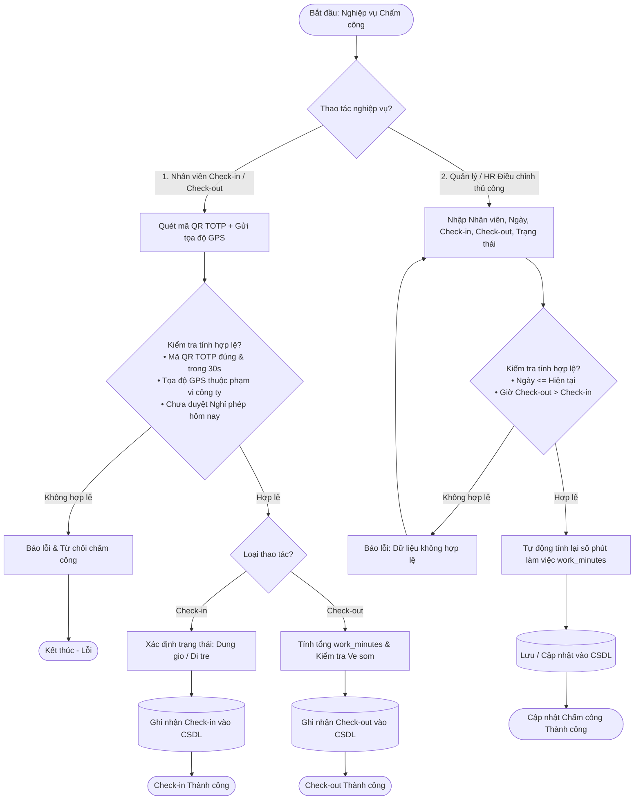
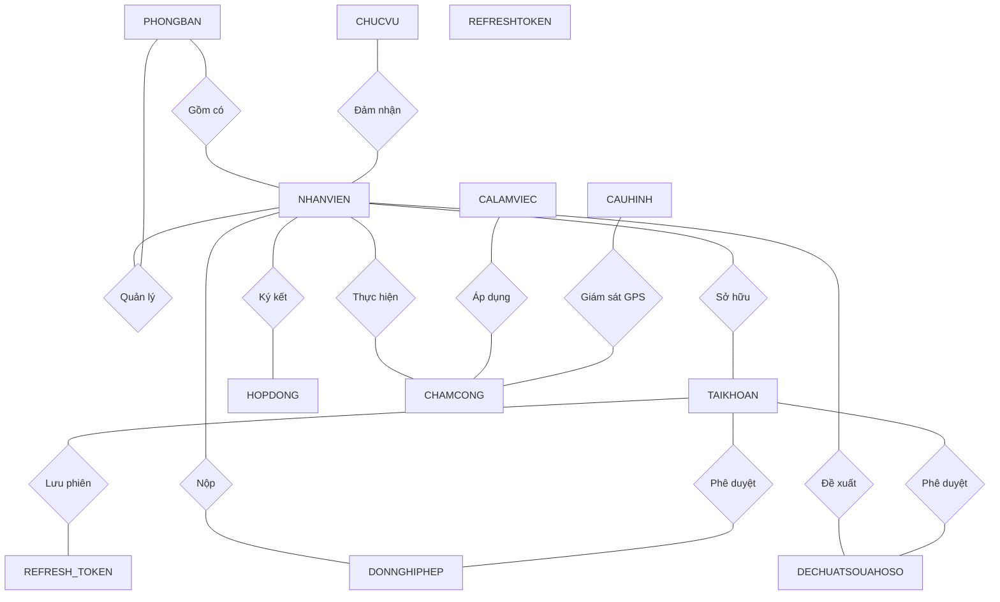
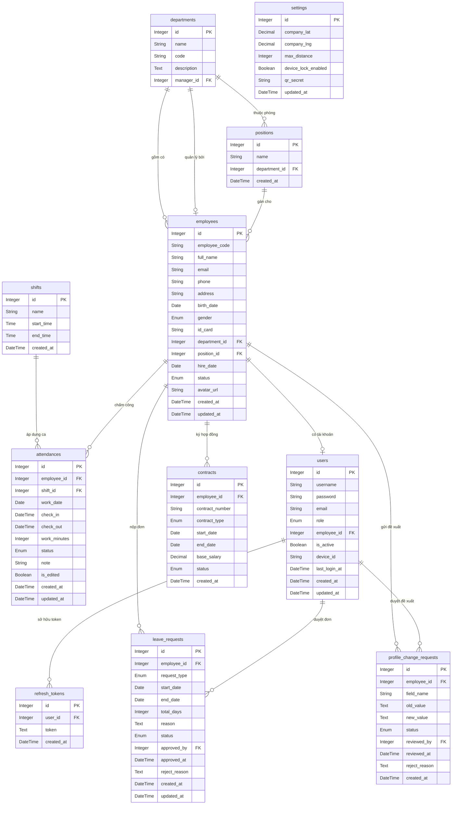
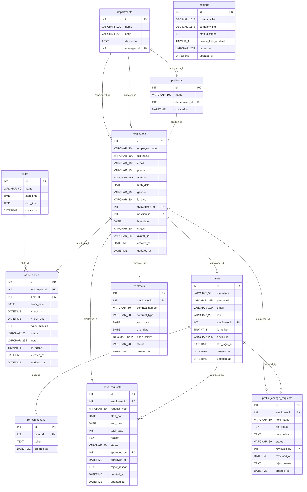

# Nhật ký công việc & Sơ đồ Hệ thống ngày 26/7/2026 (LV_HRM_Management)

Tài liệu này lưu trữ toàn bộ các mã **Mermaid Diagrams (Chuẩn Draw.io)** bao gồm:
1. Sơ đồ Hoạt động (UML Activity Diagrams): Gửi đơn, Duyệt đơn, Quản lý Chấm công.
2. Sơ đồ CSDL 3 Mức (Database ERDs): Mức Ý niệm (Chen's ERD), Mức Luận lý, Mức Vật lý (Chuẩn MySQL 11 Bảng).

---

## 🛠️ HƯỚNG DẪN SỬ DỤNG MÃ MERMAID VỚI DRAW.IO
1. Truy cập [Draw.io](https://app.diagrams.net/).
2. Trên thanh Menu chọn: **Arrange** (Sắp xếp) ➔ **Insert** (Chèn) ➔ **Advanced** (Nâng cao) ➔ **Mermaid**.
3. Sao chép và dán mã trong các khối ```mermaid bên dưới ➔ Bấm **Insert**.

---

# PHẦN I: CÁC SƠ ĐỒ HOẠT ĐỘNG (UML ACTIVITY DIAGRAMS)

## 1. SƠ ĐỒ HOẠT ĐỘNG: GỬI ĐƠN (SUBMIT REQUEST)


---

## 2. SƠ ĐỒ HOẠT ĐỘNG: DUYỆT ĐƠN (APPROVE / REJECT REQUEST)


---

## 3. SƠ ĐỒ HOẠT ĐỘNG: QUẢN LÝ CHẤM CÔNG (ATTENDANCE MANAGEMENT)


---

# PHẦN II: CÁC SƠ ĐỒ CƠ SỞ DỮ LIỆU (DATABASE ERDS - FULL 11 BẢNG)

## 1. SƠ ĐỒ MỨC Ý NIỆM (Conceptual Data Model - Chen's ERD)
> **Ký hiệu**: Hình chữ nhật = Thực thể (Entity), Hình thoi = Mối quan hệ (Relationship).



---

## 2. SƠ ĐỒ MỨC LUẬN LÝ (Logical Data Model - Full 11 Bảng & 96 Thuộc tính)


---

## 3. SƠ ĐỒ MỨC VẬT LÝ (Physical Data Model - Chuẩn tên CSDL MySQL thực tế)
> **Đặc điểm**: Kiểu dữ liệu MySQL thực tế (`INT`, `VARCHAR`, `DATETIME`, `DECIMAL`), nhãn quan hệ hiển thị tên cột khóa ngoại (FK column name).



---

## PHẦN III: SO SÁNH & PHÂN BIỆT 3 MỨC SƠ ĐỒ CSDL

| Tiêu chí so sánh | Mức Ý niệm (Conceptual) | Mức Luận lý (Logical) | Mức Vật lý (Physical) |
| :--- | :--- | :--- | :--- |
| **Mục đích** | Mô tả các đối tượng thực thể và quan hệ tổng quan ở mức khái niệm. | Mô tả **chi tiết tất cả các thuộc tính dữ liệu nghiệp vụ** độc lập CSDL. | Mô tả **chi tiết kỹ thuật cài đặt thực tế** trên CSDL MySQL cụ thể. |
| **Ký hiệu / Cấu trúc** | Thực thể (Chữ nhật), Mối quan hệ (Hình thoi). | Danh mục Bảng, Thuộc tính, Kiểu dữ liệu logic (`String`, `Integer`...), `PK`, `FK`. | Danh mục Bảng, Tên cột CSDL (`employee_code`...), Kiểu MySQL (`VARCHAR`, `INT`, `DATETIME`...), `PK`, `FK`. |
| **Nhãn đường nối** | Động từ liên kết giữa các thực thể (`Gồm có`, `Sở hữu`...). | Động từ / Tên quan hệ nghiệp vụ (`has`, `owns`, `submits`...). | Tên cột Khóa ngoại cụ thể (`department_id`, `employee_id`, `approved_by`...). |
