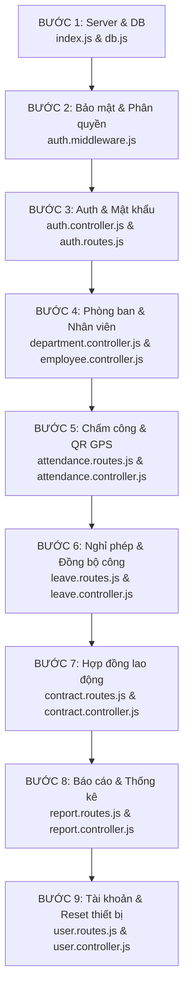
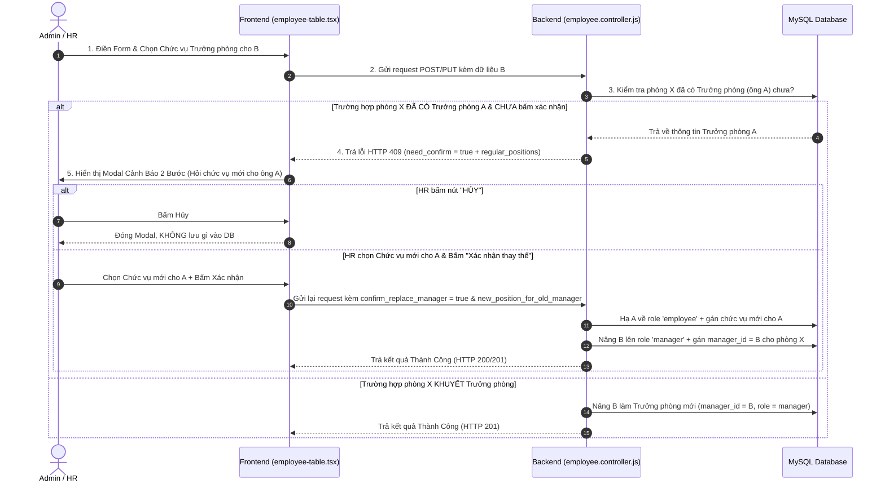
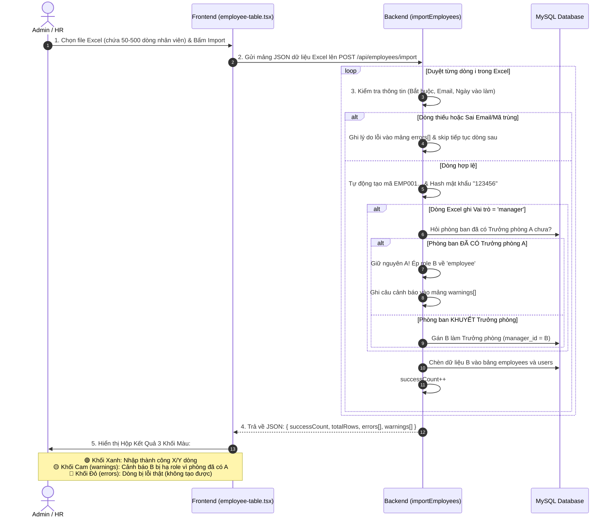

# 📘 NHẬT KÝ CÔNG VIỆC & BÀI HỌC BACKEND - FRONTEND (05/08/2026)

---

## 🗺️ 1. TỔNG QUAN LỘ TRÌNH ĐÃ HỌC & HOÀN THÀNH



---

## 🚀 2. CHI TIẾT TỪNG BƯỚC VÀ CODE ĐÃ GIẢI THÍCH

### 📌 BƯỚC 1: Khởi Tạo Server Express & Kết Nối Cơ Sở Dữ Liệu
* **`backend/src/index.js` (Entry Point):**
  * Dựng Express Server, cấu hình CORS (thông hành API) và `express.json()` (phiên dịch JSON request body).
  * Định tuyến các tiền tố API (`/api/auth`, `/api/employees`, `/api/departments`...).
  * Mở cổng `app.listen(PORT)` lắng nghe request.
* **`backend/src/config/db.js` (MySQL Connection Pool):**
  * Tạo Pool kết nối MySQL hỗ trợ `utf8mb4` (hỗ trợ lưu đầy đủ tiếng Việt & emoji).
  * Thử nghiệm kết nối ngầm khi Server khởi động.

---

### 🛡️ BƯỚC 2: Bảo Mật & Phân Quyền (`auth.middleware.js`)
* **`authMiddleware`:**
  * Lấy chuỗi Token từ Header `Authorization: Bearer <token>`.
  * Giải mã Token với `JWT_SECRET`.
  * **Device Lock (Khóa thiết bị):** So sánh `x-device-id` từ máy dùng gửi lên với `device_id` đã lưu trong DB (miễn trừ cho Admin).
  * Đính kèm `req.user = decoded` và gọi `next()` cho đi tiếp.
* **`roleMiddleware(...roles)`:**
  * Kiểm tra vai trò (`req.user.role`) xem có quyền truy cập Route hay không. Trả lỗi HTTP 403 (Forbidden) nếu không đúng quyền.

---

### 🔑 BƯỚC 3: Đăng Nhập & Chuẩn Mật Khẩu Mạnh (Strong Password)
* **Backend (`auth.controller.js` - `changePassword`):**
  * Đổi kiểm tra mật khẩu thành `strongPasswordRegex`: Bắt buộc tối thiểu 8 ký tự, gồm chữ cái, chữ số và ký tự đặc biệt (`!@#$%^&*...`).
* **Frontend (`change-password-form.tsx`):**
  * Tích hợp checklist real-time hiển thị 4 tiêu chí bên dưới ô "Mật khẩu mới", cập nhật icon `✓` (xanh) / `✗` (xám) trực tiếp khi gõ.

---

## 🔄 3. LUỒNG HOẠT ĐỘNG CHI TIẾT: THÊM TAY VÀ NHẬP EXCEL NHÂN VIÊN

### ✍️ A. LUỒNG THÊM THỦ CÔNG / CHỈNH SỬA NHÂN VIÊN (`createEmployee` & `updateEmployee`)



---

### 📊 B. LUỒNG NHẬP EXCEL HÀNG LOẠT (`importEmployees`)



---

## ⏰ 4. BƯỚC 5: CHẤM CÔNG & QUÉT MÃ QR GPS KIOSK (`attendance.routes.js` & `attendance.controller.js`)

* **Bảo vệ Máy Quét `verifyTerminalToken`:**
  * Kiểm tra Header `x-terminal-token` khớp với mã `scan_token` trong bảng `settings` để đảm bảo request gửi từ máy tính bảng đặt tại cửa công ty.
* **Bảo Mật Vị Trí GPS (Geofencing):**
  * Hàm `getDistanceMeters` áp dụng công thức Haversine tính khoảng cách Trái đất theo đường chim bay từ GPS máy quét tới GPS công ty. Nếu xa hơn 500m -> Chặn HTTP 403.
* **Xác Thực Mã QR TOTP 30s (`verifyTotp`):**
  * Mã QR có định dạng `"EMP001:123456"`. Ứng dụng xác minh mã OTP 6 số bằng Secret Key hệ thống + Mã NV trong chu kỳ 30 giây.
* **Tự Động Tính Trạng Thái:**
  * Giờ vào sau `08:30` -> Tự động ghi nhận status `"Di tre"`.
  * Giờ ra trước `17:00` VÀ đi đúng giờ -> Tự động đổi status thành `"Ve som"`.

---

## 📝 5. BƯỚC 6: XIN NGHỈ PHÉP & ĐỒNG BỘ CHẤM CÔNG (`leave.routes.js` & `leave.controller.js`)

* **Công Thức Kiểm Tra Trùng Khoảng Ngày Nghỉ:**
  * Điều kiện giao nhau: `start_date <= B_end AND end_date >= B_start`. Nếu trả về kết quả mảng có độ dài `> 0` -> Trùng ngày và bị chặn ngay.
* **Tính Số Ngày Nghỉ Thực Tế (`countWorkingDays`):**
  * Chạy vòng lặp từ ngày bắt đầu đến ngày kết thúc, kiểm tra `current.getUTCDay() !== 0` (loại trừ ngày Chủ Nhật = 0).
* **Tự Động Đồng Bộ Sang Bảng Chấm Công (`approveLeave` & `rejectLeave`):**
  * Khi Duyệt đơn (`approveLeave`): Hệ thống duyệt từng ngày nghỉ và tự động `INSERT` / `UPDATE` trạng thái `'Vang mat'` vào bảng `attendances`.
  * Bảo mật duyệt đơn: Chặn Trưởng phòng tự duyệt đơn xin nghỉ của chính mình (`existing[0].employee_id === req.user.employee_id`).

---

## 📄 6. BƯỚC 7: HỢP ĐỒNG LAO ĐỘNG (`contract.routes.js` & `contract.controller.js`)

* **Ràng Buộc Nghiệp Vụ Hợp Đồng:**
  * Một nhân viên tại một thời điểm chỉ có duy nhất **1 Hợp đồng 'Dang hieu luc'**.
  * Chặn tạo hoặc gia hạn hợp đồng cho nhân viên đã nghỉ việc (`status = 'Nghi viec'`).
  * Chỉ duy nhất **Admin** mới có quyền đơn phương chấm dứt thanh lý Hợp đồng (`terminateContract`).
* **Truy Vấn Cảnh Báo Hết Hạn 30 Ngày (`getExpiringContracts`):**
  * Đợi sẵn lệnh SQL `c.end_date <= DATE_ADD(CURDATE(), INTERVAL 30 DAY) AND c.end_date >= CURDATE()` để lọc các hợp đồng sắp hết hạn trong 1 tháng tới.

---

## 📊 7. BƯỚC 8: BÁO CÁO THỐNG KÊ (`report.routes.js` & `report.controller.js`)

* **Kỹ Thuật Gom Nhóm SQL (SUM CASE WHEN):**
  * Gom nhóm tính tổng số công `COUNT(a.id)`, tổng ngày Đúng giờ, Đi trễ, Về sớm, Vắng mặt trong cùng 1 câu lệnh SQL duy nhất giúp trang DashBoard load cực nhanh.

---

## 👤 8. BƯỚC 9: TÀI KHOẢN HỆ THỐNG & RESET THIẾT BỊ (`user.routes.js` & `user.controller.js`)

### 🔍 CHI TIẾT HÀM `updateUser` (Cập nhật Vai trò & Hồ sơ):

```javascript
export async function updateUser(req, res) {
  try {
    const { role, employee_id } = req.body
    const [existing] = await pool.execute("SELECT id, role, employee_id FROM users WHERE id = ?", [req.params.id])
    if (existing.length === 0) return res.status(404).json({ message: "Không tìm thấy tài khoản" })

    // 1. Kiểm tra nếu gán tài khoản cho Nhân viên B mà Nhân viên B đã có tài khoản khác rồi -> Chặn lại
    if (employee_id) {
      const [dupEmp] = await pool.execute("SELECT id FROM users WHERE employee_id = ? AND id != ?", [employee_id, req.params.id])
      if (dupEmp.length > 0) return res.status(400).json({ message: "Nhân viên này đã có tài khoản khác" })
    }

    const oldUser = existing[0]
    let warningMessage = ""

    // 2. ⭐ LOGIC BẢO VỆ DỮ LIỆU: TỰ ĐỘNG HẠ CHỨC TRƯỞNG PHÒNG NẾU HẠ ROLE
    // Nếu tài khoản này trước đó đang mang role 'manager' mà Admin đổi sang role 'employee' hoặc khác:
    if (oldUser.role === "manager" && role !== "manager" && oldUser.employee_id) {
      // Tìm xem người này có đang là Trưởng phòng của phòng ban nào không
      const [deptRows] = await pool.execute(
        "SELECT id, name FROM departments WHERE manager_id = ?",
        [oldUser.employee_id]
      )
      // Nếu ĐANG LÀ TRƯỞNG PHÒNG -> Tự động xóa manager_id của người này về NULL ở bảng departments
      if (deptRows.length > 0) {
        await pool.execute("UPDATE departments SET manager_id = NULL WHERE manager_id = ?", [oldUser.employee_id])
        const deptNames = deptRows.map(d => d.name).join(", ")
        warningMessage = ` (Đã tự động bỏ chức Trưởng phòng tại: ${deptNames})`
      }
    }

    // 3. Cập nhật role mới và employee_id mới vào MySQL
    await pool.execute(
      "UPDATE users SET role = ?, employee_id = ? WHERE id = ?",
      [role, employee_id || null, req.params.id]
    )
    return res.json({ message: `Cập nhật thành công${warningMessage}` })
  } catch (err) {
    console.error(err)
    return res.status(500).json({ message: "Lỗi server" })
  }
}
```

### 🔓 Cụm 3 Hàm Reset Thiết Bị (Mở khóa Device Lock khi Nhân viên đổi máy mới):
1. **`resetDevice`**: Admin reset mở khóa theo ID Tài Khoản.
2. **`resetDeviceByEmployee`**: Manager/HR/Admin mở khóa theo ID Nhân Viên (Manager mở khóa được cho nhân viên thuộc phòng mình).
3. **`resetDeviceByDepartment`**: Mở khóa hàng loạt `device_id = NULL` cho TẤT CẢ nhân viên trong cả 1 Phòng Ban.

---

*📁 File nhật ký tổng hợp đầy đủ được lưu tại:* `c:\Users\quang\Desktop\LV_HRM_Management\5-8-2026.md`
