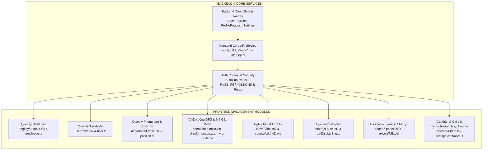

# 📘 NHẬT KÝ BÀI HỌC & CÔNG VIỆC TỔNG HỢP (06/08/2026)

---

## 🗺️ 1. SƠ ĐỒ TỔNG QUAN NỘI DUNG ĐÃ HỌC HÔM NAY

---

## 🛠️ 2. CHI TIẾT CÁC MODULE BACKEND & SERVICE CORE

### 👤 A. Module Tài khoản (`User`)
* **`updateUser`**: Cập nhật `role` và `employee_id`. Đảm bảo quan hệ 1-1 giữa nhân viên và tài khoản. Tự động xóa `manager_id = NULL` ở bảng `departments` nếu tài khoản bị hạ quyền từ `manager` xuống role khác.
* **`toggleUser`**: Khóa / Mở khóa tài khoản (`is_active` = 0/1). Chặn không cho Admin tự khóa chính mình.
* **`resetPassword`**: Băm mật khẩu mới bằng `bcrypt.hash()` và cập nhật theo `user.id`.
* **`resetDevice` / `resetDeviceByEmployee` / `resetDeviceByDepartment`**: Reset `device_id = NULL` cá nhân hoặc hàng loạt cho toàn bộ nhân viên thuộc 1 phòng ban.

---

### 💼 B. Module Chức vụ (`Position`)
* **`getPositions`**: Lấy danh sách chức vụ, tên phòng ban, đếm số nhân viên (`employee_count`).
* **`updatePosition`**: Cập nhật tên và phòng ban. Khi tên chứa từ `"Trưởng phòng"` -> Tự động thăng role tài khoản lên `'manager'` và gán `manager_id` cho phòng ban. Khi bỏ từ `"Trưởng phòng"` -> Hạ role về `'employee'` và giải phóng `manager_id = NULL`.

---

### 📝 C. Module Yêu cầu Sửa Hồ sơ (`ProfileRequest`)
* Phạm vi đổi: Chỉ cho phép chỉnh sửa `phone` và `address`.
* **`createRequest`**: Nhân viên gửi yêu cầu đổi SĐT/Địa chỉ. Chặn gửi trùng khi đã có yêu cầu đang `Cho duyet`.
* **`approveRequest`**: Admin/HR/Manager duyệt yêu cầu -> Cập nhật trực tiếp giá trị mới vào bảng `employees` và đổi trạng thái yêu cầu sang `'Da duyet'`.
* **`rejectRequest`**: Từ chối yêu cầu kèm lý do (`reject_reason`).

---

### ⚙️ D. Module Cấu hình Hệ thống (`Settings`)
* Bảng `settings` tập trung ở bản ghi `id = 1`.
* **`getSettings` / `updateSettings`**: Cấu hình vị trí văn phòng (GPS `company_lat`, `company_lng`) và bán kính tối đa được chấm công (`max_distance`).
* **`updateDeviceLock`**: Bật/Tắt tính năng khóa thiết bị chấm công và xóa bộ nhớ đệm `clearSettingsCache()`.
* **`updateScanPassword` / `activateScanTerminal`**: Đặt mật khẩu và cấp Token ngẫu nhiên cho máy quét chấm công Kiosk ở sảnh công ty.

---

### ⚡ E. 8 Luồng Xử Lý Trong `frontend/services/api.ts`
1. **Luồng 1 (Khởi tạo Axios)**: Tạo khung `api` mặc định gốc `http://localhost:5000/api`.
2. **Luồng 2 (Dán Access Token)**: Tự động lấy `hrm_access_token` từ `localStorage` dán vào Header `Authorization: Bearer <token>`.
3. **Luồng 3 (Dán Device ID)**: Dán thêm mã định danh máy `X-Device-Id` vào Header.
4. **Luồng 4 (Lỗi 401 & Hàng chờ)**: Khi bị 401, các request đến sau chui vào hàng chờ `failedQueue` nằm đợi.
5. **Luồng 5 (Đi xin Token mới)**: Request đầu tiên bật `isRefreshing = true`, lấy `hrm_refresh_token` gửi lên `/api/auth/refresh`.
6. **Luồng 6 (Phát Token cho Hàng chờ)**: Nhận vé mới -> Lưu `localStorage` và gọi `processQueue(null, newToken)` giải thoát các request đang chờ.
7. **Luồng 7 (Thử lại Request)**: Dán Token mới vào lá thư đại diện ban đầu và tự động gửi lại.
8. **Luồng 8 (Logout toàn bộ)**: Nếu xin Token thất bại (Refresh Token hết hạn 7 ngày) -> Xóa sạch Token + Cookie và chuyển về `/login`.

---

## 💻 3. CHI TIẾT CÁC COMPONENT FRONTEND ĐÃ HỌC

### 🏢 1. Quản lý Nhân viên (`employee-table.tsx`)
* **Lịch chọn ngày `CalendarPicker`**: Custom giao diện tiếng Việt, có dropdown đổi năm nhanh.
* **Cảnh báo thay thế Trưởng phòng `confirmReplace`**: Khi thêm/sửa nhân viên giữ chức Trưởng phòng đã có người nắm giữ -> Hiện Modal yêu cầu chọn chức vụ mới cho Trưởng phòng cũ trước khi thay thế.
* **Nhập Excel `handleExcelImport`**: Đọc file `.xlsx` từ client, kiểm tra trùng lặp email/SĐT/CCCD/Mã NV, hiển thị bảng kết quả nhập thành công & danh sách dòng bị lỗi.
* **Fix Bug Event Handler**: Đổi `onClick={handleEdit}` -> `onClick={() => handleEdit()}` để tránh truyền `React.MouseEvent` làm tham số `confirmReplace_`.

---

### 🔑 2. Quản lý Tài khoản (`user-table.tsx`)
* **Phân quyền & Hiển thị**: Hiển thị nhãn vai trò (`Quản trị viên`, `Nhân sự`, `Quản lý`, `Nhân viên`) kèm tên phòng ban đang quản lý.
* **Thao tác**: Đổi role, gán với mã nhân viên, đặt lại mật khẩu, khóa/mở tài khoản, reset ID thiết bị cá nhân hoặc toàn bộ phòng ban.

---

### 🏛️ 3. Quản lý Phòng ban (`department-table.tsx`)
* Hiển thị số lượng nhân viên thuộc phòng ban, danh sách phòng ban và tên Trưởng phòng.
* Modal sửa phòng ban tự động lọc chỉ những nhân viên **thuộc phòng ban đó** mới được bầu làm Trưởng phòng.

---

### 📍 4. Chấm công GPS & QR Code (`checkin-button.tsx` & `my-qr-code.tsx`)
* **`checkin-button.tsx`**: Sử dụng `navigator.geolocation.getCurrentPosition` lấy tọa độ thiết bị gửi lên `/api/attendances/self-checkin` & `/api/attendances/self-checkout`.
* **`my-qr-code.tsx`**: Lấy chuỗi mã hóa từ `/api/employees/my-qr`, dùng thư viện `qrcode` sinh ảnh QR. Đồng hồ tự đếm ngược 30s tạo mã mới để chống gian lận chấm công bằng ảnh chụp màn hình.

---

### 📅 5. Quản lý Nghỉ phép (`leave-table.tsx`)
* **Hàm `countWorkingDays`**: Tự động tính tổng số ngày nghỉ thực tế từ `start_date` đến `end_date` và **tự động loại trừ ngày Chủ nhật**.
* **Luồng phê duyệt**: Nhân viên gửi đơn (`Cho duyet`) -> Quản lý / Admin / HR duyệt đơn hoặc từ chối kèm lý do (`reject_reason`).

---

### 📜 6. Quản lý Hợp đồng Lao động (`contract-table.tsx`)
* **Hàm `getDisplayStatus`**: Tự động so sánh `end_date` với ngày hiện tại để gắn nhãn real-time: `Đang hiệu lực`, `Sắp hết hạn` (dưới 30 ngày), `Đã hết hạn`, `Đã chấm dứt`.
* **Thêm mới HĐ**: Dropdown `<datalist>` tự động lọc bỏ các nhân viên **đang có hợp đồng còn hiệu lực**.

---

### 📊 7. Báo cáo & Biểu đồ (`reports-panel.tsx`)
* **Tích hợp Chart.js**:
  * **Biểu đồ Cột (`AttendanceBarChart`)**: Thống kê số nhân viên đi làm theo các ngày trong tháng.
  * **Biểu đồ Tròn (`AttendanceDoughnutChart`)**: Phân tích tỷ lệ % Đúng giờ, Đi trễ, Vắng mặt, Về sớm.
* **Tự động xuất Excel (`exportToExcel`)**: Cho phép tải xuống file `.xlsx` chi tiết chấm công, phòng ban, nghỉ phép.

---

### 👤 8. Hồ sơ cá nhân & Cài đặt (`my-profile-info.tsx` & `change-password-form.tsx`)
* **`my-profile-info.tsx`**: Nhân viên yêu cầu sửa SĐT/Địa chỉ -> Tự sinh `profile_request` chờ HR duyệt, hiển thị trạng thái `(đang chờ duyệt)` trên ô input.
* **`change-password-form.tsx`**: Form đổi mật khẩu kiểm tra 4 điều kiện mật khẩu mạnh thời gian thực (Độ dài 8+, có chữ cái, chữ số, ký tự đặc biệt).
* **`statusConfig`**: Map mã trạng thái CSDL (`"Cho duyet"`, `"Da duyet"`, `"Tu choi"`) thành nhãn tiếng Việt, màu sắc Tailwind và Icon Lucide tương ứng.

---

## 📚 4. CHI TIẾT CÁC HÀM TRONG TẤT CẢ CÁC FILE BACKEND (CẬP NHẬT LÚC 6:44 AM)

### 🔑 A. `src/controllers/auth.controller.js` (Xác thực tài khoản)
* **`login(req, res)`**: Đăng nhập `email` + `password` + `device_id`. Kiểm tra Device Lock, ghi nhận `last_login_at = NOW()`, cấp 2 Token (`accessToken` 15 phút & `refreshToken` 7 ngày).
* **`refreshToken(req, res)`**: Kiểm tra Refresh Token hợp lệ và chưa bị vô hiệu hóa -> Cấp `accessToken` mới.
* **`logout(req, res)`**: Xóa Refresh Token trong bảng `refresh_tokens`.
* **`getMe(req, res)`**: Trả về hồ sơ chi tiết người dùng đang đăng nhập.
* **`changePassword(req, res)`**: Đổi mật khẩu cá nhân (Kiểm tra mật khẩu cũ + kiểm tra Regex mật khẩu mạnh + Băm bcrypt).

---

### 👥 B. `src/controllers/employee.controller.js` (Quản lý Nhân viên)
* **`getEmployees(req, res)`**: Lấy danh sách nhân viên. Bảo mật tự động ẩn các thông tin nhạy cảm tùy theo Role.
* **`getEmployeeById(req, res)`**: Lấy chi tiết hồ sơ 1 nhân viên theo ID.
* **`createEmployee(req, res)`**: Thêm nhân viên + tự động tạo user ngầm. Cảnh báo lỗi 409 nếu chọn vị trí Trưởng phòng đã có người nắm giữ.
* **`updateEmployee(req, res)`**: Cập nhật thông tin nhân viên & tự động thăng/hạ chức Trưởng phòng ở `departments` & `users`.
* **`deleteEmployee(req, res)`**: Vô hiệu hóa nhân viên (`status = 'Da nghi'`).
* **`permanentDeleteEmployee(req, res)`**: Admin xóa vĩnh viễn dòng nhân viên khỏi database.
* **`importEmployees(req, res)`**: Nhập danh sách nhân viên hàng loạt từ file Excel `.xlsx`.
* **`getMyQR(req, res)`**: Sinh mã TOTP QR chấm công hết hạn 30s.
* **`verifyQR(req, res)`**: Kiosk quét sảnh gọi xác thực tính hợp lệ của mã QR.
* **`resetDeviceAll(req, res)`** / **`resetDeviceByDepartment(req, res)`**: Reset `device_id = NULL` mở khóa máy cho toàn bộ công ty hoặc 1 phòng ban.

---

### 👤 C. `src/controllers/user.controller.js` (Tài khoản Đăng nhập)
* **`getUsers(req, res)`**: Lấy danh sách tài khoản hệ thống (Deduplicate ghép mảng tên phòng ban quản lý).
* **`createUser(req, res)`**: Admin tạo tài khoản thủ công.
* **`updateUser(req, res)`**: Đổi role hoặc liên kết `employee_id`. Tự xóa `manager_id = NULL` ở `departments` nếu bị hạ quyền.
* **`toggleUser(req, res)`**: Khóa/Mở khóa trạng thái `is_active` của tài khoản.
* **`resetPassword(req, res)`**: Ghi đè mật khẩu băm mới cho user.
* **`resetDevice(req, res)`** / **`resetDeviceByEmployee(req, res)`**: Reset `device_id = NULL` theo User ID hoặc Employee ID.

---

### 🏛️ D. `src/controllers/department.controller.js` (Phòng ban)
* **`getDepartments(req, res)`**: Lấy danh sách phòng ban + tên Trưởng phòng + đếm số nhân viên.
* **`getDepartmentById(req, res)`**: Lấy chi tiết 1 phòng ban.
* **`createDepartment(req, res)`**: Tạo phòng ban mới (Tự thăng role `manager` nếu chọn Trưởng phòng).
* **`updateDepartment(req, res)`**: Cập nhật tên, mô tả và đổi Trưởng phòng.
* **`deleteDepartment(req, res)`**: Xóa phòng ban (Chặn xóa nếu phòng ban đang chứa nhân viên).

---

### 💼 E. `src/controllers/position.controller.js` (Chức vụ)
* **`getPositions(req, res)`**: Lấy tất cả chức vụ và danh sách tên nhân viên giữ chức vụ.
* **`getPositionsByDepartment(req, res)`**: Lấy các chức vụ thuộc 1 phòng ban cụ thể.
* **`createPosition(req, res)`**: Tạo chức vụ mới.
* **`updatePosition(req, res)`**: Cập nhật tên chức vụ (**Tự động thăng/hạ role `manager`** dựa theo chữ "Trưởng phòng").
* **`deletePosition(req, res)`**: Xóa chức vụ (Chặn xóa nếu có nhân viên nắm giữ).

---

### ⏰ F. `src/controllers/attendance.controller.js` (Chấm công GPS & Kiosk)
* **`getAttendances(req, res)`**: Lấy bảng lịch sử chấm công (Lọc Tháng/Năm/Phòng ban).
* **`getAttendanceById(req, res)`**: Lấy chi tiết 1 bản ghi chấm công.
* **`createAttendance(req, res)`** / **`updateAttendance(req, res)`**: Admin/HR chèn hoặc sửa giờ chấm công thủ công.
* **`selfCheckIn(req, res)`** / **`selfCheckOut(req, res)`**: Chấm công tự động bằng tọa độ GPS di động (Tính công thức Haversine so với vị trí văn phòng).
* **`kioskCheckIn(req, res)`**: Ghi nhận chấm công từ Kiosk quét mã QR sảnh.

---

### 📅 G. `src/controllers/leave.controller.js` (Đơn xin Nghỉ phép)
* **`getLeaves(req, res)`** / **`getLeaveById(req, res)`**: Lấy danh sách hoặc chi tiết đơn nghỉ phép.
* **`createLeave(req, res)`**: Nộp đơn nghỉ phép (**Backend tự tính `total_days` và tự động trừ ngày Chủ nhật**).
* **`approveLeave(req, res)`**: Duyệt đơn nghỉ phép (Chặn Manager tự duyệt đơn của mình).
* **`rejectLeave(req, res)`**: Từ chối đơn nghỉ phép kèm lý do `reject_reason`.

---

### 📜 H. `src/controllers/contract.controller.js` (Hợp đồng lao động)
* **`getContracts(req, res)`** / **`getContractById(req, res)`**: Lấy bảng hoặc chi tiết hợp đồng lao động.
* **`getExpiringContracts(req, res)`**: Lọc danh sách hợp đồng **sắp hết hạn trong 30 ngày**.
* **`createContract(req, res)`**: Tạo hợp đồng mới.
* **`renewContract(req, res)`**: Gia hạn hợp đồng với `end_date` mới.
* **`terminateContract(req, res)`**: Chấm dứt hợp đồng trước hạn.

---

### 📝 I. `src/controllers/profileRequest.controller.js` (Yêu cầu đổi SĐT / Địa chỉ)
* **`createRequest(req, res)`**: Nhân viên gửi yêu cầu đổi SĐT/Địa chỉ.
* **`getMyRequests(req, res)`** / **`getAllRequests(req, res)`**: Xem danh sách yêu cầu cá nhân hoặc danh sách tất cả yêu cầu chờ duyệt.
* **`approveRequest(req, res)`**: Phê duyệt -> Tự động ghi đè thông tin mới vào bảng `employees`.
* **`rejectRequest(req, res)`**: Từ chối yêu cầu kèm lý do.

---

### 📊 J. `src/controllers/report.controller.js` (Báo cáo Thống kê)
* **`getAttendanceReport(req, res)`**: Thống kê số ngày Đúng giờ, Đi trễ, Vắng mặt, Tổng giờ làm.
* **`getDepartmentReport(req, res)`**: Thống kê nhân sự đang làm / đã nghỉ theo phòng ban.
* **`getLeaveReport(req, res)`**: Thống kê số ngày nghỉ được duyệt / chờ duyệt / từ chối.
* **`getContractReport(req, res)`**: Thống kê số hợp đồng theo từng trạng thái.

---

### ⚙️ K. `src/controllers/settings.controller.js` (Cài đặt Hệ thống)
* **`getSettings(req, res)`** / **`updateSettings(req, res)`**: Lấy và cập nhật tọa độ GPS công ty & bán kính tối đa.
* **`updateDeviceLock(req, res)`**: Bật/Tắt khóa thiết bị cố định (`clearSettingsCache()`).
* **`updateScanPassword(req, res)`** / **`activateScanTerminal(req, res)`**: Cài mật khẩu và xác thực sinh Token cho máy quét sảnh Kiosk.

---

### 🛡️ L. `src/middlewares/auth.middleware.js` (Middleware Phân quyền)
* **`authenticateToken(req, res, next)`**: Xác thực JWT Token.
* **`authorizeRoles(...roles)`**: Phân quyền theo vai trò.
* **`checkDeviceLock(req, res, next)`**: Kiểm tra thiết bị hợp lệ khi bật Device Lock.
* **`clearSettingsCache()`**: Xóa cache cài đặt hệ thống.

---

### 🎲 M. `src/utils/totp.js` (Tạo & Xác thực Mã QR 30s)
* **`generateSecret()`**: Sinh secret key ngẫu nhiên.
* **`generateTOTP(secret)`**: Sinh mã TOTP hết hạn sau 30 giây.
* **`verifyTOTP(secret, token)`**: Xác thực mã QR từ máy quét sảnh.
