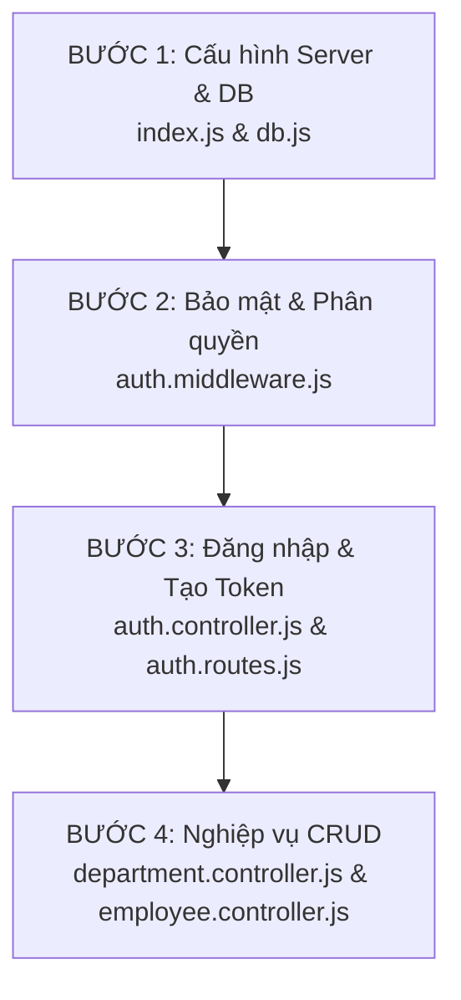

# 📘 CẨM NANG HỌC TOÀN BỘ BACKEND PROJECT (LV_HRM_MANAGEMENT)

> 📅 **Ngày cập nhật**: 03/08/2026  
> 🎯 **Tóm tắt**: Tài liệu hướng dẫn học Backend từ cơ bản đến nâng cao, giải thích dòng từng dòng code, phân tích cơ chế bảo mật JWT Token, Middleware, Controller và Routing.

---

## 🗺️ LỘ TRÌNH HỌC BACKEND 4 BƯỚC



---

## 🚀 FILE 1: `backend/src/index.js` (Bàn Tiếp Tân / Entry Point)

File này là **nơi đầu tiên khởi chạy ứng dụng Express**.

### 🔍 Giải thích dòng từng dòng:
```js
1: // Khai báo các thư viện chính
2: import express from "express" // Framework tạo Server & Route
3: import cors from "cors"       // Vé thông hành cho phép Frontend gọi API
4: import dotenv from "dotenv"   // Đọc biến môi trường ẩn từ file .env
5: 
6: // Import các file định tuyến (Routes)
7: import authRoutes from "./routes/auth.routes.js"
8: import employeeRoutes from "./routes/employee.routes.js"
9: import departmentRoutes from "./routes/department.routes.js"
10: // ...
11: 
12: dotenv.config() // Nạp biến môi trường .env
13: 
14: const app  = express()
15: const PORT = process.env.PORT || 5000 // Chạy ở cổng 5000
16: 
17: app.use(cors({ origin: "*", credentials: true })) // Bật CORS
18: app.use(express.json()) // Người phiên dịch: dịch chuỗi JSON gửi lên thành req.body
19: 
20: // Gắn tiền tố URL cho từng Router
21: app.use("/api/auth",        authRoutes)       // Mọi API bắt đầu bằng /api/auth -> vào authRoutes
22: app.use("/api/employees",   employeeRoutes)   // Mọi API bắt đầu bằng /api/employees -> vào employeeRoutes
23: app.use("/api/departments", departmentRoutes) // Mọi API bắt đầu bằng /api/departments -> vào departmentRoutes
24: 
25: app.get("/", (req, res) => {
26:   res.json({ message: "HRM API đang chạy 🚀" }) // Route kiểm tra server
27: })
28: 
29: app.listen(PORT, () => {
30:   console.log(`🚀 Server đang chạy tại http://localhost:${PORT}`)
31: })
```

---

## 🛡️ FILE 2: `backend/src/middlewares/auth.middleware.js` (Lực Lượng Bảo An)

File này đóng vai trò **gác cổng kiểm tra Đăng nhập, Khóa thiết bị (Device Lock) và Phân quyền (Role)**.

### 🔍 Giải thích dòng từng dòng:
```js
1: let settingsCache = null
2: let settingsCacheTime = 0
3: const CACHE_TTL = 60 * 1000 // Bộ nhớ tạm 60 giây tránh spam query MySQL
4: 
5: export function clearSettingsCache() {
6:   settingsCache = null // Xóa cache khi Admin đổi cài đặt
7:   settingsCacheTime = 0
8: }
9: 
10: async function getDeviceLockEnabled() {
11:   // Lấy trạng thái Khóa thiết bị (Bật/Tắt) từ RAM cache hoặc MySQL
12:   const now = Date.now()
13:   if (settingsCache !== null && now - settingsCacheTime < CACHE_TTL) return settingsCache
14:   const [rows] = await pool.execute("SELECT device_lock_enabled FROM settings WHERE id = 1")
15:   settingsCache = rows.length > 0 ? rows[0].device_lock_enabled === 1 : false
16:   settingsCacheTime = now
17:   return settingsCache
18: }
19: 
20: export async function authMiddleware(req, res, next) {
21:   const authHeader = req.headers.authorization
22:   // Kiểm tra phải bắt đầu bằng 'Bearer ' (Chuẩn HTTP RFC 6750)
23:   if (!authHeader || !authHeader.startsWith("Bearer ")) {
24:     return res.status(401).json({ message: "Không có token" })
25:   }
26:   const token = authHeader.split(" ")[1] // Cắt bỏ chữ 'Bearer ' để lấy Token nguyên bản
27:   const deviceId = req.headers["x-device-id"]
28: 
29:   try {
30:     const decoded = jwt.verify(token, process.env.JWT_SECRET) // Giải mã chìa khóa
31: 
32:     // Device Lock: Kiểm tra thiết bị đăng nhập (Không áp dụng cho Admin)
33:     if (decoded.role !== "admin") {
34:       const deviceLockEnabled = await getDeviceLockEnabled()
35:       if (deviceLockEnabled) {
36:         const [rows] = await pool.execute("SELECT device_id FROM users WHERE id = ?", [decoded.id])
37:         if (rows.length > 0 && rows[0].device_id && rows[0].device_id !== deviceId) {
38:           return res.status(401).json({ message: "Tài khoản đang được sử dụng trên thiết bị khác" })
39:         }
40:       }
41:     }
42: 
43:     req.user = decoded // Gán thông tin user vào req.user
44:     next() // Cho phép đi tiếp vào Controller
45:   } catch (err) {
46:     return res.status(401).json({ message: "Token không hợp lệ hoặc đã hết hạn" })
47:   }
48: }
49: 
50: export function roleMiddleware(...roles) {
51:   return (req, res, next) => {
52:     // Kiểm tra xem role của user có nằm trong danh sách được phép không
53:     if (!req.user || !roles.includes(req.user.role)) {
54:       return res.status(403).json({ message: "Bạn không có quyền thực hiện thao tác này" })
55:     }
56:     next()
57:   }
58: }
```

---

## 🔑 FILE 3: `backend/src/controllers/auth.controller.js` (Đăng Nhập & Quản Lý Token)

### 💡 CƠ CHẾ TOKEN CHA & TOKEN CON (OAUTH 2.0 / JWT)

```text
 🔑 Refresh Token (Token Cha - 7 Ngày)  --->  Lưu trong MySQL + Máy người dùng (Cất kỹ trong két)
 🎟️ Access Token (Token Con - 15 Phút) --->  Dùng đi lướt web hàng ngày (Hết 15m tự lấy Cha đổi vé mới)
```

* **Token Con (`generateAccessToken`)**: Sống 15 phút. Nhét nhiều thông tin (`id`, `email`, `role`, `employee_id`) để Backend giải mã xài ngay trên RAM mà **không tốn 1 câu lệnh MySQL nào**.
* **Token Cha (`generateRefreshToken`)**: Sống 7 ngày. Chỉ nhét `id`. Dùng âm thầm xin vé mới. Nếu Admin khóa tài khoản, Token Cha bị xóa trong MySQL $\rightarrow$ Lập tức chặn đứng hacker!

### 🔍 Giải thích các hàm trong Auth Controller:
1. `generateAccessToken(user)`: Sản xuất Access Token 15m.
2. `generateRefreshToken(user)`: Sản xuất Refresh Token 7d.
3. `login(req, res)`:
   * Kiểm tra email & mật khẩu qua `bcrypt.compare`.
   * Tự động đăng ký `device_id` nếu máy chưa có.
   * Tạo 2 Token và lưu `refreshToken` vào bảng `refresh_tokens` trong MySQL.
4. `logout(req, res)`: Xóa `refreshToken` khỏi MySQL.
5. `refreshToken(req, res)`: Giải mã Refresh Token, kiểm tra tài khoản còn hoạt động không (`is_active == 1`), tạo Access Token 15m mới trả về.
6. `getMe(req, res)`: Lấy thông tin cá nhân mới nhất của người dùng.
7. `changePassword(req, res)`: Đối chiếu mật khẩu cũ và băm mật khẩu mới bằng `bcrypt.hash`.

---

## 🚦 FILE 4: `backend/src/routes/auth.routes.js` (Chỉ Đường Auth)

```js
router.post("/login",           login)                          // Đăng nhập (Công khai)
router.post("/logout",          logout)                         // Đăng xuất
router.post("/refresh",         refreshToken)                   // Xin cấp lại Token mới
router.get("/me",               authMiddleware, getMe)          // Lấy thông tin bản thân (Cần đăng nhập)
router.post("/change-password", authMiddleware, changePassword) // Đổi mật khẩu (Cần đăng nhập)
```

---

## 🏢 FILE 5: `backend/src/controllers/department.controller.js` (Nghiệp Vụ Phòng Ban & Transaction)

File này áp dụng **Transaction CSDL** (`conn.beginTransaction()`, `conn.commit()`, `conn.rollback()`) để xử lý nâng/hạ quyền Trưởng phòng an toàn.

### 🔍 Các hàm xử lý:
1. `getDepartments(req, res)`: `SELECT` phòng ban `LEFT JOIN` với nhân viên để lấy tên Trưởng phòng.
2. `getDepartmentById(req, res)`: Lấy 1 phòng ban theo ID.
3. `createDepartment(req, res)`: Thêm phòng ban mới. Nếu có gán Trưởng phòng $\rightarrow$ Tự động nâng `role` của tài khoản đó lên `'manager'`.
4. `updateDepartment(req, res)` *(Phức tạp nhất)*:
   * Nếu đổi sang Trưởng phòng MỚI $\rightarrow$ Nâng role người mới lên `'manager'` + Đổi chức vụ thành "Trưởng phòng...".
   * Nếu hạ Trưởng phòng CŨ $\rightarrow$ Kiểm tra người cũ còn làm trưởng phòng nơi khác không, nếu không còn thì hạ role về `'employee'` + Đổi chức vụ thành nhân viên thường.
   * Đảm bảo tính toàn vẹn bằng `commit()` / `rollback()`.
5. `deleteDepartment(req, res)`: Kiểm tra nếu còn nhân viên thuộc phòng $\rightarrow$ Chặn không cho xóa.

---

## 🚥 FILE 6: `backend/src/routes/department.routes.js` (Phân Quyền Route Phòng Ban)

```js
router.get("/",       authMiddleware, getDepartments)                           // Mọi role đã đăng nhập đều xem được
router.get("/:id",    authMiddleware, getDepartmentById)                        // Mọi role đã đăng nhập đều xem được
router.post("/",      authMiddleware, roleMiddleware("admin", "hr"), createDepartment) // Chỉ Admin & HR mới được tạo
router.put("/:id",    authMiddleware, roleMiddleware("admin", "hr"), updateDepartment) // Chỉ Admin & HR mới được sửa
router.delete("/:id", authMiddleware, roleMiddleware("admin"), deleteDepartment)     // CHỈ DUY NHẤT ADMIN MỚI ĐƯỢC XÓA!
```

---

## 👤 FILE 7: `backend/src/controllers/employee.controller.js` (Nghiệp Vụ Nhân Viên & Bảo Mật)

### 🔍 Các điểm đặc biệt cần nhớ:
1. `getEmployees(req, res)`:
   * **Phân quyền dữ liệu**: Nếu là `manager` $\rightarrow$ Chỉ thấy nhân viên thuộc phòng ban mình quản lý (`e.department_id IN (...)`).
   * **Ẩn thông tin nhạy cảm (Data Masking)**: 
     * `employee` xem người khác $\rightarrow$ Ẩn `email`, `phone`, `id_card` (CCCD), `address`, `birth_date`.
     * `manager` xem người khác $\rightarrow$ Ẩn `id_card`, `address`.
2. `createEmployee(req, res)`:
   * Kiểm tra trùng Email / Mã Nhân Viên.
   * Chèn dữ liệu vào bảng `employees`.
   * **Tự động tạo tài khoản `users`**: Lấy tên email trước `@` làm username, băm mật khẩu mặc định `"123456"`.
   * Nếu chức vụ có từ "Trưởng phòng" $\rightarrow$ Tự động nâng `role` lên `'manager'`.

---

🎉 **CHÚC BẠN HỌC TỐT! BẠN CÓ THỂ MỞ FILE NÀY XEM LẠI BẤT KỲ LÚC NÀO.**
